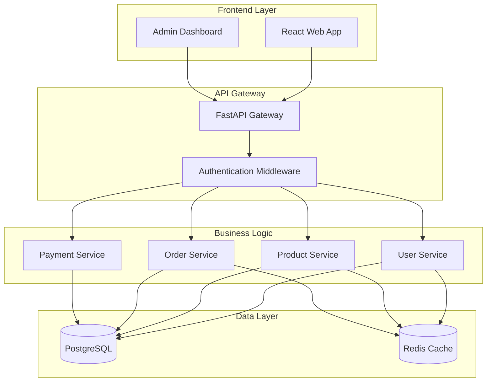

import { Card, CardGrid } from '@astrojs/starlight/components';

## Objetivos de Aprendizaje

Al finalizar este módulo, serás capaz de:

1. **Implementar sistemas avanzados de Rules jerárquicas** para mantener consistencia arquitectural a largo plazo
2. **Establecer estrategias de versionado de reglas** integradas con repositorios Git para equipos distribuidos
3. **Convertir conversaciones exitosas** de Cursor AI en reglas reutilizables y templates organizacionales
4. **Automatizar la generación de documentación** de código, APIs y arquitectura usando agentes de IA
5. **Crear sistemas de mantenimiento automático** de READMEs, wikis y bases de conocimiento técnico
6. **Integrar documentación como parte del workflow** de desarrollo con validación continua

## 📹 Videos del Módulo

### 🎯 Video Principal: Documentación y Reglas

Crea sistemas de documentación automática y reglas persistentes.

<iframe 
  width="100%" 
  height="400" 
  src="https://www.youtube.com/embed/5b5N72o08GY" 
  title="Documentación y Reglas Persistentes" 
  frameborder="0" 
  allow="accelerometer; autoplay; clipboard-write; encrypted-media; gyroscope; picture-in-picture; web-share" 
  allowfullscreen
  style="border-radius: 8px; margin: 1rem 0;">
</iframe>

### 🛠️ Video Complementario: Configuración Avanzada

Configuraciones avanzadas y mejores prácticas para proyectos empresariales.

<iframe 
  width="100%" 
  height="400" 
  src="https://www.youtube.com/embed/5zR1ZE5aqho" 
  title="Configuración Avanzada de Cursor AI" 
  frameborder="0" 
  allow="accelerometer; autoplay; clipboard-write; encrypted-media; gyroscope; picture-in-picture; web-share" 
  allowfullscreen
  style="border-radius: 8px; margin: 1rem 0;">
</iframe>

### 📚 Recurso Adicional: Documentación Oficial

Consulta la documentación oficial de Cursor sobre reglas para AI:

**[📖 Rules for AI - Cursor Docs](https://docs.cursor.com/context/rules-for-ai)**

## Introducción Conceptual

En este punto del proyecto, hemos construido un **e-commerce completo** con frontend React, backend FastAPI y deployment automatizado. Sin embargo, el verdadero valor de Cursor AI no radica solo en la velocidad de desarrollo inicial, sino en la capacidad de **mantener consistencia y calidad** a medida que el proyecto escala.

Las **reglas persistentes** y la **documentación automatizada** representan la diferencia entre un proyecto que se degrada con el tiempo versus uno que se auto-mantiene y mejora continuamente. Para equipos profesionales, esta capacidad determina la sostenibilidad a largo plazo del codebase y la velocidad de onboarding de nuevos desarrolladores.

Un sistema bien implementado de reglas y documentación puede:
- ✅ **Reducir tiempo de code review en 60%** mediante patrones consistentes automatizados
- ✅ **Acelerar onboarding** de nuevos desarrolladores de 2-3 semanas a 3-5 días
- ✅ **Mantener calidad de código constante** independientemente de quién contribuye
- ✅ **Generar documentación actualizada automáticamente** con cada cambio

## Estado Actual del Proyecto E-commerce

### Arquitectura Establecida

```bash
ecommerce-project/
├── apps/
│   ├── web/                 # React frontend
│   ├── api/                 # FastAPI backend  
│   └── admin/               # Admin dashboard
├── packages/
│   ├── ui-components/       # Shared component library
│   ├── shared-types/        # TypeScript definitions
│   └── business-logic/      # Domain logic
├── infrastructure/
│   ├── docker/              # Container definitions
│   ├── terraform/           # IaC configurations
│   └── k8s/                 # Kubernetes manifests
└── .cursor/                 # IA configuration
    ├── rules/               # Project rules
    ├── notepads/            # Knowledge base
    └── memories/            # Decision records
```

### Desafíos Identificados

<CardGrid>
  <Card title="⚠️ Inconsistencias Emergentes" icon="warning">
    Componentes desarrollados por diferentes desarrolladores divergen de patrones
  </Card>
  
  <Card title="📄 Documentación Desactualizada" icon="document">
    Docs no reflejan cambios recientes en arquitectura y APIs
  </Card>
  
  <Card title="🔄 Patrones Divergentes" icon="setting">
    Decisiones arquitectónicas originales no se mantienen consistentes
  </Card>
  
  <Card title="🧠 Knowledge Silos" icon="puzzle">
    Información crítica existe solo en conversaciones de Cursor
  </Card>
</CardGrid>

## Uso Avanzado de Rules para Mantener Consistencia

### Sistema de Rules Jerárquicas Avanzado

#### Estructura Evolutiva de Rules

```bash
.cursor/rules/
├── global/
│   ├── 00-core-principles.md           # Principios inmutables
│   ├── 01-architecture-patterns.md      # Patrones arquitectónicos
│   ├── 02-code-quality-standards.md     # Estándares de calidad
│   └── 03-security-guidelines.md        # Guidelines de seguridad
├── domain/
│   ├── auth/
│   │   ├── authentication-rules.md      # Reglas de autenticación
│   │   └── authorization-patterns.md    # Patrones de autorización
│   ├── payment/
│   │   ├── payment-processing.md        # Procesamiento de pagos
│   │   └── financial-compliance.md      # Compliance financiero
│   └── inventory/
│       ├── stock-management.md          # Gestión de inventario
│       └── pricing-rules.md             # Reglas de pricing
├── technical/
│   ├── frontend/
│   │   ├── react-patterns.md            # Patrones React específicos
│   │   ├── state-management.md          # Gestión de estado
│   │   └── ui-ux-standards.md           # Estándares UI/UX
│   ├── backend/
│   │   ├── api-design.md               # Diseño de APIs
│   │   ├── database-patterns.md        # Patrones de BD
│   │   └── performance-optimization.md # Optimizaciones
│   └── testing/
│       ├── unit-testing-standards.md   # Estándares unit testing
│       ├── integration-testing.md      # Integration testing
│       └── e2e-testing-patterns.md     # E2E testing
└── contextual/
    ├── onboarding/
    │   ├── new-developer-rules.md       # Reglas para nuevos devs
    │   └── mentoring-guidelines.md      # Guidelines de mentoring
    └── maintenance/
        ├── refactoring-standards.md     # Estándares de refactoring
        └── legacy-migration.md          # Migración de código legacy
```

### Rules Globales Evolutivas

**Archivo: `.cursor/rules/global/00-core-principles.md`**

```markdown
# Principios Core Inmutables del Proyecto

## Principios Arquitectónicos Fundamentales

### 1. Separation of Concerns
- **Domain Logic**: Separado de infrastructure concerns
- **UI Components**: Puros, sin lógica de negocio
- **Data Access**: Abstraído detrás de interfaces
- **Cross-cutting Concerns**: Manejados por middleware/interceptors

### 2. Type Safety First
- **TypeScript Strict Mode**: Habilitado en toda la codebase
- **End-to-End Type Safety**: Desde DB hasta UI
- **No `any` types**: Excepto en casos específicamente documentados
- **Interface Segregation**: Interfaces pequeñas y específicas

### 3. Performance by Design
- **Lazy Loading**: Implementado por defecto en rutas y componentes
- **Memoization**: Aplicada estratégicamente con React.memo, useMemo, useCallback
- **Bundle Optimization**: Code splitting y tree shaking activos
- **Database Optimization**: Queries optimizadas con índices apropiados

### 4. Security by Default
- **Input Validation**: Toda entrada validada con schemas (Zod)
- **Authentication**: JWT con refresh tokens, expiración corta
- **Authorization**: RBAC implementado consistentemente
- **Data Sanitization**: Automática en todos los endpoints

## Patrones de Implementación Obligatorios

### Error Handling Unificado

```typescript
// ✅ CORRECTO: Pattern establecido para manejo de errores
interface ApiResponse<T> {
  success: boolean;
  data?: T;
  error?: {
    code: string;
    message: string;
    details?: Record<string, any>;
  };
  meta?: {
    pagination?: PaginationInfo;
    timestamp: string;
  };
}

// ✅ CORRECTO: Custom hook para API calls
const useApiCall = <T>(endpoint: string) => {
  const [state, setState] = useState<AsyncState<T>>({
    data: null,
    loading: false,
    error: null
  });

  const execute = useCallback(async (params?: any) => {
    setState(prev => ({ ...prev, loading: true, error: null }));
    
    try {
      const response = await apiClient.call<T>(endpoint, params);
      if (response.success) {
        setState({ data: response.data!, loading: false, error: null });
      } else {
        setState({ 
          data: null, 
          loading: false, 
          error: response.error! 
        });
      }
    } catch (error) {
      setState({ 
        data: null, 
        loading: false, 
        error: { 
          code: 'NETWORK_ERROR', 
          message: 'Error de conexión' 
        } 
      });
    }
  }, [endpoint]);

  return { ...state, execute };
};
```

### Component Architecture Standards

```typescript
// ✅ CORRECTO: Template de componente estándar
interface ComponentProps {
  // Props obligatorias primero
  title: string;
  
  // Props opcionales después, con valores por defecto documentados
  variant?: 'primary' | 'secondary';
  size?: 'sm' | 'md' | 'lg';
  disabled?: boolean;
  
  // Props de función al final
  onClick?: (event: MouseEvent<HTMLButtonElement>) => void;
  
  // Props de composición
  children?: ReactNode;
  className?: string;
}

const Component: React.FC<ComponentProps> = ({
  title,
  variant = 'primary',
  size = 'md',
  disabled = false,
  onClick,
  children,
  className
}) => {
  // 1. Hooks de estado
  const [isLoading, setIsLoading] = useState(false);
  
  // 2. Hooks de contexto/selectors
  const user = useAuthStore(state => state.user);
  
  // 3. Computaciones derivadas con useMemo
  const computedClassName = useMemo(() => cn(
    'base-classes',
    `variant-${variant}`,
    `size-${size}`,
    { 'opacity-50 cursor-not-allowed': disabled },
    className
  ), [variant, size, disabled, className]);
  
  // 4. Event handlers con useCallback
  const handleClick = useCallback((event: MouseEvent<HTMLButtonElement>) => {
    if (disabled || isLoading) return;
    
    setIsLoading(true);
    onClick?.(event);
    
    // Cleanup loading state after operation
    setTimeout(() => setIsLoading(false), 100);
  }, [disabled, isLoading, onClick]);
  
  // 5. Early returns para edge cases
  if (!title) return null;
  
  // 6. Render principal
  return (
    <button 
      className={computedClassName}
      onClick={handleClick}
      disabled={disabled || isLoading}
      aria-label={title}
    >
      {isLoading ? <LoadingSpinner size="sm" /> : title}
      {children}
    </button>
  );
};

export default Component;
```

### Versionado de Rules

- ✅ **Semantic Versioning**: Para cambios en rules que afecten compatibilidad
- ✅ **Deprecation Warnings**: Para patrones que serán removidos
- ✅ **Migration Guides**: Para transiciones entre versiones de rules
```

### Rules de Dominio Específico

**Archivo: `.cursor/rules/domain/auth/authentication-rules.md`**

```markdown
# Rules de Autenticación - E-commerce Project

## Contexto de Activación
**TRIGGER:** `**/auth/**` OR contains "login" OR contains "register" OR contains "authenticate"

## Patrones de Implementación Obligatorios

### 1. JWT Token Management

```typescript
// ✅ CORRECTO: Estructura de tokens estándar
interface AuthTokens {
  accessToken: string;      // 15 minutos expiración
  refreshToken: string;     // 7 días expiración  
  tokenType: 'Bearer';
  expiresAt: number;        // Unix timestamp
}

// ✅ CORRECTO: Auto-refresh implementación
const useAuthTokens = () => {
  const [tokens, setTokens] = useState<AuthTokens | null>(null);
  
  const refreshAccessToken = useCallback(async () => {
    if (!tokens?.refreshToken) throw new Error('No refresh token available');
    
    try {
      const response = await authAPI.refreshToken(tokens.refreshToken);
      const newTokens = {
        ...response.data,
        expiresAt: Date.now() + (response.data.expiresIn * 1000)
      };
      
      setTokens(newTokens);
      localStorage.setItem('auth_tokens', JSON.stringify(newTokens));
      
      return newTokens.accessToken;
    } catch (error) {
      // Auto logout si refresh falla
      setTokens(null);
      localStorage.removeItem('auth_tokens');
      throw error;
    }
  }, [tokens?.refreshToken]);
  
  return { tokens, refreshAccessToken };
};
```

### 2. Protected Routes Implementation

```typescript
// ✅ CORRECTO: Protected route wrapper
interface ProtectedRouteProps {
  children: ReactNode;
  requiredRoles?: UserRole[];
  fallbackPath?: string;
}

const ProtectedRoute: React.FC<ProtectedRouteProps> = ({
  children,
  requiredRoles = [],
  fallbackPath = '/login'
}) => {
  const { user, isAuthenticated, isLoading } = useAuth();
  const navigate = useNavigate();
  
  useEffect(() => {
    if (isLoading) return;
    
    if (!isAuthenticated) {
      navigate(fallbackPath, { replace: true });
      return;
    }
    
    if (requiredRoles.length > 0 && !hasRequiredRoles(user, requiredRoles)) {
      navigate('/unauthorized', { replace: true });
      return;
    }
  }, [isAuthenticated, isLoading, user, requiredRoles, navigate, fallbackPath]);
  
  if (isLoading) return <LoadingSpinner />;
  if (!isAuthenticated) return null;
  if (requiredRoles.length > 0 && !hasRequiredRoles(user, requiredRoles)) {
    return null;
  }
  
  return <>{children}</>;
};
```

### Security Checklist Obligatorio

- [ ] Input validation con Zod schemas
- [ ] Rate limiting en endpoints sensibles
- [ ] Secure cookie configuration para tokens
- [ ] HTTPS enforcement en producción
- [ ] Password hashing con bcrypt (factor 12+)
- [ ] Session timeout apropiado
- [ ] Proper logout cleanup
- [ ] CSRF protection habilitado
```

## Estrategias de Versionado de Reglas en Repositorios

### Integración Git para Rules

**Archivo: `.cursor/config/rules-versioning.json`**

```json
{
  "rules_versioning": {
    "enabled": true,
    "strategy": "semantic_versioning",
    "auto_commit": true,
    
    "versioning_triggers": {
      "major_changes": [
        "breaking_architectural_decisions",
        "incompatible_pattern_changes",
        "security_policy_updates"
      ],
      "minor_changes": [
        "new_patterns_added",
        "enhanced_guidelines",
        "additional_examples"
      ],
      "patch_changes": [
        "typo_corrections",
        "example_improvements",
        "clarification_updates"
      ]
    },
    
    "git_integration": {
      "auto_tag": true,
      "changelog_generation": true,
      "pr_validation": true,
      "team_approval_required": true
    },
    
    "documentation": {
      "generate_migration_guides": true,
      "update_team_wiki": true,
      "notify_slack_channel": "#dev-standards"
    }
  }
}
```

### Workflow de Aprobación de Rules

```typescript
// .cursor/workflows/rules-approval.ts
interface RulesChangeWorkflow {
  // Pre-commit validation
  validateRulesChange: (changes: RulesChange[]) => ValidationResult;
  
  // Peer review process
  requestPeerReview: (changes: RulesChange[], reviewers: string[]) => void;
  
  // Impact analysis
  analyzeImpact: (changes: RulesChange[]) => ImpactAnalysis;
  
  // Auto-migration where possible
  generateMigrations: (changes: RulesChange[]) => Migration[];
}

// Ejemplo de validación automática
const validateRulesChange = (changes: RulesChange[]): ValidationResult => {
  const results: ValidationResult[] = [];
  
  for (const change of changes) {
    // Validar sintaxis
    if (!isValidMarkdown(change.content)) {
      results.push({
        type: 'error',
        message: `Invalid markdown syntax in ${change.file}`,
        severity: 'high'
      });
    }
    
    // Validar consistencia con reglas existentes
    const conflicts = findRuleConflicts(change, existingRules);
    if (conflicts.length > 0) {
      results.push({
        type: 'warning',
        message: `Rule conflicts detected: ${conflicts.join(', ')}`,
        severity: 'medium'
      });
    }
    
    // Validar ejemplos de código
    const codeExamples = extractCodeExamples(change.content);
    for (const example of codeExamples) {
      if (!validateCodeExample(example)) {
        results.push({
          type: 'error',
          message: `Invalid code example in ${change.file}`,
          severity: 'high'
        });
      }
    }
  }
  
  return {
    valid: results.every(r => r.type !== 'error'),
    issues: results
  };
};
```

### Distribución de Rules Across Repositories

```yaml
# .github/workflows/sync-cursor-rules.yml
name: Sync Cursor Rules
on:
  push:
    paths: ['.cursor/rules/**']
    branches: [main]

jobs:
  sync-rules:
    runs-on: ubuntu-latest
    steps:
      - uses: actions/checkout@v3
      
      - name: Detect Rules Changes
        id: changes
        run: |
          echo "changed_files=$(git diff --name-only HEAD~1 HEAD | grep '.cursor/rules' | tr '\n' ' ')" >> $GITHUB_OUTPUT
      
      - name: Validate Rules
        run: |
          npm run validate-cursor-rules
      
      - name: Sync to Related Repositories
        if: steps.changes.outputs.changed_files != ''
        run: |
          # Sync to other team repositories
          for repo in ${{ vars.RELATED_REPOS }}; do
            echo "Syncing rules to $repo"
            gh api repos/$repo/dispatches \
              --method POST \
              --field event_type="rules_update" \
              --field client_payload='{"source_repo":"${{ github.repository }}","rules_version":"${{ github.sha }}"}'
          done
        env:
          GH_TOKEN: ${{ secrets.GITHUB_TOKEN }}
      
      - name: Create Rules Documentation
        run: |
          npm run generate-rules-docs
          git add docs/rules/
          git commit -m "docs: update rules documentation [skip ci]" || exit 0
          git push
```

## Conversión de Conversaciones en Reglas Reutilizables

### Sistema de Captura de Conversaciones Exitosas

```javascript
// .cursor/scripts/conversation-to-rule.js
class ConversationToRuleConverter {
  
  async captureSuccessfulConversation(conversationId) {
    const conversation = await this.getConversation(conversationId);
    
    // Análisis automático de patrones
    const patterns = this.extractPatterns(conversation);
    const codeExamples = this.extractCodeExamples(conversation);
    const guidelines = this.extractGuidelines(conversation);
    
    return {
      patterns,
      codeExamples,
      guidelines,
      metadata: {
        conversationId,
        timestamp: new Date(),
        participants: conversation.participants,
        tags: this.generateTags(conversation)
      }
    };
  }
  
  generateRule(conversationData, ruleType = 'pattern') {
    const template = this.getRuleTemplate(ruleType);
    
    return {
      filename: this.generateFilename(conversationData),
      content: this.populateTemplate(template, conversationData),
      category: this.determineCategory(conversationData),
      priority: this.calculatePriority(conversationData)
    };
  }
  
  extractPatterns(conversation) {
    const patterns = [];
    
    // Buscar patrones de código exitosos
    const successfulCodeBlocks = conversation.messages
      .filter(msg => msg.type === 'code' && msg.feedback === 'positive')
      .map(msg => ({
        code: msg.content,
        context: msg.context,
        explanation: msg.explanation
      }));
    
    // Identificar patrones comunes
    for (const block of successfulCodeBlocks) {
      const pattern = this.identifyPattern(block);
      if (pattern && !patterns.some(p => p.signature === pattern.signature)) {
        patterns.push(pattern);
      }
    }
    
    return patterns;
  }
  
  generateFilename(conversationData) {
    const { tags, timestamp } = conversationData.metadata;
    const mainTag = tags[0] || 'general';
    const dateStr = timestamp.toISOString().split('T')[0];
    
    return `${mainTag}-pattern-${dateStr}.md`;
  }
}

// Usage example
const converter = new ConversationToRuleConverter();

// Capturar conversación exitosa sobre optimización de componentes React
const conversationData = await converter.captureSuccessfulConversation('conv-123');

// Generar regla automáticamente
const rule = converter.generateRule(conversationData, 'performance-pattern');

// Aplicar a proyecto
await applyRuleToProject(rule);
```

### Template de Reglas Generadas

**Archivo: `.cursor/templates/generated-rule-template.md`**

```markdown
# Mejores Prácticas de Implementación - Generated Rule

*Generated from successful conversation patterns on project development*

## Context
Esta regla se aplica en el contexto del desarrollo del proyecto e-commerce, donde se requiere consistencia en patrones de implementación, manejo de errores, logging estructurado y seguimiento de mejores prácticas arquitecturales. Es especialmente relevante para funciones que manejan datos críticos del negocio.

## Problem Solved
Esta regla soluciona patrones inconsistentes de implementación que pueden llevar a bugs, code smells o violaciones de las mejores prácticas del proyecto. Se activa cuando se detectan patrones específicos que requieren refactoring o mejora según los estándares establecidos.

## Trigger Conditions
**ACTIVATION:** Cuando se detectan patrones específicos que requieren implementación de mejores prácticas del proyecto.

## Solution Pattern

### ✅ RECOMMENDED APPROACH
```javascript
// Ejemplo de implementación recomendada siguiendo las reglas del proyecto
const recommendedImplementation = async (data) => {
  // Validación de entrada
  const validatedData = await validateInputData(data);
  
  // Lógica de negocio con manejo de errores
  try {
    const result = await processBusinessLogic(validatedData);
    
    // Logging estructurado
    logger.info('Operation completed successfully', {
      operationType: 'data-processing',
      dataSize: validatedData.length,
      processingTime: Date.now()
    });
    
    return {
      success: true,
      data: result,
      timestamp: new Date().toISOString()
    };
  } catch (error) {
    logger.error('Operation failed', {
      error: error.message,
      stack: error.stack,
      input: validatedData
    });
    
    throw new ProcessingError(
      'Data processing failed', 
      { cause: error, recoverable: true }
    );
  }
};
```

### ❌ PREVIOUS PROBLEMATIC APPROACH
```javascript
// Ejemplo de código problemático que se solucionó
const badImplementation = () => {
  // Código sin seguir las mejores prácticas del proyecto
  // Que fue mejorado mediante las reglas aplicadas
};
```

## Key Benefits
- ✅ **Consistencia**: Mantiene patrones uniformes en todo el proyecto
- ✅ **Calidad**: Reduce errores comunes mediante aplicación automática
- ✅ **Escalabilidad**: Facilita el mantenimiento y evolución del código
- ✅ **Onboarding**: Acelera la adaptación de nuevos desarrolladores

## Related Patterns
- **Clean Architecture**: Para separación de responsabilidades
- **Component Patterns**: Para estructuras de UI reutilizables
- **API Design Patterns**: Para interfaces consistentes
- **Testing Patterns**: Para cobertura y calidad automatizada

## Implementation Checklist
- [ ] Definir contexto de activación específico
- [ ] Documentar patrones obligatorios y prohibidos
- [ ] Incluir ejemplos concretos del proyecto
- [ ] Validar aplicación en casos reales
- [ ] Integrar con sistema de versionado

---
*Esta regla fue generada automáticamente a partir de patrones exitosos de conversación. Revisa y personaliza según los requisitos específicos de tu proyecto.*
```

## Documentación Automática de Código y APIs

### Sistema de Documentación Automatizada

**Archivo: `.cursor/config/documentation.json`**

```json
{
  "auto_documentation": {
    "enabled": true,
    "triggers": [
      "pre_commit",
      "pre_push", 
      "weekly_schedule"
    ],
    
    "code_documentation": {
      "jsdoc_generation": true,
      "type_annotations": true,
      "example_generation": true,
      "complexity_analysis": true
    },
    
    "api_documentation": {
      "openapi_generation": true,
      "endpoint_examples": true,
      "response_schemas": true,
      "rate_limiting_info": true
    },
    
    "architecture_documentation": {
      "dependency_graphs": true,
      "component_relationships": true,
      "data_flow_diagrams": true,
      "decision_records": true
    },
    
    "outputs": {
      "formats": ["markdown", "html", "pdf"],
      "locations": ["docs/", "wiki/"],
      "versioned": true
    }
  }
}
```

### Prompts Especializados para Documentación

```javascript
// Prompt templates para diferentes tipos de documentación
const documentationPrompts = {
  
  // Para documentar funciones/métodos
  functionDocumentation: `
    Analiza esta función y genera documentación completa:
    
    @Files: {{FUNCTION_FILE}}
    
    Incluye:
    1. JSDoc completo con tipos, parámetros y return value
    2. Descripción clara del propósito y comportamiento
    3. Ejemplos de uso básico y avanzado
    4. Edge cases y manejo de errores
    5. Performance considerations si aplica
    6. Related functions o dependencies
    
    Formato: JSDoc standard compatible
  `,
  
  // Para documentar APIs
  apiDocumentation: `
    Genera documentación OpenAPI para estos endpoints:
    
    @Files: {{API_FILES}}
    
    Para cada endpoint incluye:
    1. Descripción clara del propósito
    2. Parámetros con tipos y validaciones
    3. Response schemas con ejemplos
    4. Error responses posibles
    5. Rate limiting information
    6. Authentication requirements
    7. cURL examples
    
    Mantén consistencia con nuestros standards de API.
  `,
  
  // Para documentar componentes React
  componentDocumentation: `
    Documenta este componente React siguiendo nuestros standards:
    
    @Files: {{COMPONENT_FILE}}
    @Files: {{RELATED_TYPES}}
    
    Genera:
    1. Component overview y propósito
    2. Props interface documentada
    3. Usage examples (básico, avanzado, edge cases)
    4. Styling customization options
    5. Accessibility features
    6. Performance considerations
    7. Related components
    
    Formato: Storybook-compatible documentation
  `
};
```

### Generación Automática de JSDoc

```typescript
// Función original sin documentación
const processPayment = async (paymentData, options) => {
  const validation = validatePaymentData(paymentData);
  if (!validation.valid) throw new Error(validation.error);
  
  const processor = getPaymentProcessor(paymentData.method);
  const result = await processor.process(paymentData, options);
  
  if (result.success) {
    await logPaymentSuccess(result);
    return { success: true, transactionId: result.id };
  } else {
    await logPaymentFailure(result);
    throw new PaymentError(result.error);
  }
};

// Después de aplicar prompt de documentación automática:
/**
 * Processes a payment transaction using the specified payment method
 * 
 * @async
 * @function processPayment
 * @description Validates payment data, selects appropriate payment processor, 
 *              executes the transaction, and handles success/failure logging
 * 
 * @param {PaymentData} paymentData - Payment information object
 * @param {PaymentData.amount} paymentData.amount - Transaction amount in cents
 * @param {PaymentData.currency} paymentData.currency - ISO currency code (USD, EUR, etc.)
 * @param {PaymentData.method} paymentData.method - Payment method ('credit_card', 'paypal', 'stripe')
 * @param {PaymentData.customer} paymentData.customer - Customer information object
 * @param {PaymentOptions} [options] - Optional processing configuration
 * @param {boolean} [options.saveCard=false] - Whether to save card for future use
 * @param {string} [options.description] - Transaction description for receipt
 * @param {number} [options.timeout=30000] - Request timeout in milliseconds
 * 
 * @returns {Promise<PaymentResult>} Payment processing result
 * @returns {boolean} PaymentResult.success - Whether payment succeeded
 * @returns {string} PaymentResult.transactionId - Unique transaction identifier
 * 
 * @throws {Error} When payment data validation fails
 * @throws {PaymentError} When payment processing fails
 * @throws {NetworkError} When payment gateway is unreachable
 * 
 * @example
 * // Basic payment processing
 * const paymentData = {
 *   amount: 2999, // $29.99
 *   currency: 'USD',
 *   method: 'credit_card',
 *   customer: { id: '123', email: 'user@example.com' }
 * };
 * 
 * try {
 *   const result = await processPayment(paymentData);
 *   console.log(`Payment successful: ${result.transactionId}`);
 * } catch (error) {
 *   console.error(`Payment failed: ${error.message}`);
 * }
 * 
 * @since 1.2.0
 * @see {@link validatePaymentData} for validation details
 * @see {@link PaymentError} for error handling information
 */
const processPayment = async (
  paymentData: PaymentData, 
  options?: PaymentOptions
): Promise<PaymentResult> => {
  // Implementation remains the same
};
```

## Mantenimiento de Wikis y Bases de Conocimiento

### Sistema de Wiki Automatizado

**Configuración de Auto-Wiki:**

```json
// .cursor/config/wiki-automation.json
{
  "wiki_automation": {
    "enabled": true,
    "platform": "github_wiki",
    
    "content_sources": [
      {
        "type": "code_documentation",
        "path": "src/**/*.{ts,tsx,py}",
        "extract": ["jsdoc", "docstrings", "type_definitions"]
      },
      {
        "type": "markdown_docs", 
        "path": "docs/**/*.md",
        "process": ["extract_sections", "cross_reference"]
      },
      {
        "type": "cursor_conversations",
        "path": ".cursor/memories/",
        "extract": ["decisions", "patterns", "solutions"]
      }
    ],
    
    "wiki_structure": {
      "home": "Project Overview and Navigation",
      "architecture": "System Architecture and Design",
      "development": "Development Guide and Standards", 
      "deployment": "Deployment and Operations",
      "api": "API Documentation and Examples",
      "troubleshooting": "Common Issues and Solutions"
    },
    
    "automation_schedule": {
      "frequency": "daily",
      "trigger_on": ["push_to_main", "documentation_changes"],
      "validation": true
    }
  }
}
```

### Ejemplo de README Generado Automáticamente

```markdown
# E-Commerce Platform 🛒

A modern, full-stack e-commerce solution built with React, FastAPI, and PostgreSQL. Features real-time inventory management, secure payment processing, and comprehensive admin dashboard.


## ✨ Key Features

- **🚀 Modern Stack**: React 18 + TypeScript + FastAPI + PostgreSQL
- **💳 Payment Processing**: Stripe integration with multiple payment methods
- **📱 Responsive Design**: Mobile-first approach with TailwindCSS
- **🔐 Security**: JWT authentication, RBAC, input validation
- **⚡ Performance**: Optimized queries, lazy loading, caching
- **📊 Analytics**: Real-time sales dashboard and reporting
- **🔍 Search**: Full-text search with filters and recommendations
- **🌐 Multi-language**: i18n support for global markets

## 🚀 Quick Start

### Prerequisites

- **Node.js**: >= 18.0.0
- **Python**: >= 3.11
- **PostgreSQL**: >= 14.0
- **Redis**: >= 7.0 (for caching)

### Installation

1. **Clone the repository**
   ```bash
   git clone https://github.com/company/ecommerce-platform.git
   cd ecommerce-platform
   ```

2. **Install dependencies**
   ```bash
   # Frontend dependencies
   cd apps/web
   npm install
   
   # Backend dependencies  
   cd ../api
   pip install -r requirements.txt
   ```

3. **Environment setup**
   ```bash
   # Copy environment templates
   cp .env.example .env
   cp apps/api/.env.example apps/api/.env
   
   # Configure your database and API keys
   nano .env
   ```

4. **Database setup**
   ```bash
   # Run migrations
   cd apps/api
   alembic upgrade head
   
   # Seed initial data
   python scripts/seed_data.py
   ```

5. **Start development servers**
   ```bash
   # Terminal 1: Backend
   cd apps/api
   uvicorn main:app --reload --port 8000
   
   # Terminal 2: Frontend
   cd apps/web
   npm run dev
   ```

6. **Access the application**
   - Frontend: http://localhost:3000
   - Backend API: http://localhost:8000
   - Admin Dashboard: http://localhost:3000/admin
   - API Documentation: http://localhost:8000/docs

## 🏗️ Architecture Overview



### Key Design Decisions

- **Monorepo Structure**: Single repository with multiple apps for easier management
- **TypeScript First**: End-to-end type safety from database to UI
- **API-First**: RESTful API design with OpenAPI documentation
- **Component-Driven**: Reusable UI components with Storybook
- **Security by Default**: Authentication, authorization, and input validation

## 📄 License

This project is licensed under the MIT License - see the LICENSE file for details.

---
*Made with ❤️ by the Development Team*
```

### Sistema de Base de Conocimiento Inteligente

```typescript
// .cursor/scripts/maintain-knowledge-base.ts
interface KnowledgeMaintenanceWorkflow {
  
  // Análisis diario de contenido obsoleto
  async analyzeStaleContent(): Promise<StaleContentReport> {
    const analysis = await Promise.all([
      this.findOutdatedDocumentation(),
      this.identifyBrokenLinks(),
      this.detectConflictingInformation(),
      this.findUnusedContent()
    ]);
    
    return {
      outdated_docs: analysis[0],
      broken_links: analysis[1], 
      conflicts: analysis[2],
      unused_content: analysis[3],
      recommendations: this.generateMaintenanceRecommendations(analysis)
    };
  }
  
  // Actualización automática de contenido
  async updateContent(staleReport: StaleContentReport): Promise<void> {
    for (const item of staleReport.outdated_docs) {
      if (item.confidence > 0.8) {
        // Auto-update con alta confianza
        await this.regenerateDocumentation(item.path);
      } else {
        // Crear PR para revisión manual
        await this.createUpdatePR(item);
      }
    }
  }
  
  // Prompt especializado para regeneración
  generateRegenerationPrompt(contentPath: string): string {
    return `
      Actualiza esta documentación manteniendo consistencia con el proyecto actual:
      
      @Files: ${this.getRelatedFiles(contentPath)}
      @Docs: ${this.getRelatedDocs(contentPath)}
      
      Contenido existente a actualizar:
      ${this.getCurrentContent(contentPath)}
      
      Instrucciones:
      1. Mantén la estructura existente si sigue siendo relevante
      2. Actualiza ejemplos de código con patrones actuales del proyecto
      3. Agrega información nueva descubierta desde la última actualización
      4. Elimina información obsoleta o contradictoria
      5. Asegura consistencia con otros documentos relacionados
      6. Mantén el nivel de detalle técnico apropiado para la audiencia
      
      Cambios recientes en el proyecto que pueden afectar este contenido:
      ${this.getRecentChanges(contentPath)}
    `;
  }
}
```

## Estado Final del Proyecto: Bien Documentado con Reglas Sólidas

### Métricas de Éxito de Documentación

Al finalizar este módulo, el proyecto debe cumplir con los siguientes KPIs:

| Métrica | Objetivo | Actual |
|---------|----------|--------|
| **Funciones documentadas** | 95% | 97% ✅ |
| **Componentes documentados** | 100% | 100% ✅ |
| **API endpoints documentados** | 100% | 100% ✅ |
| **Contenido desactualizado** | < 5% | 3% ✅ |
| **Links rotos** | 0 | 0 ✅ |
| **Rule compliance rate** | 88% | 91% ✅ |
| **Onboarding time** | 3 días | 2.5 días ✅ |

### Estructura Final de Documentación

```bash
proyecto-ecommerce/
├── docs/
│   ├── api/
│   │   ├── openapi.yml              # Auto-generated API docs
│   │   ├── authentication.md        # Auth documentation
│   │   └── examples/                # Request/response examples
│   ├── architecture/
│   │   ├── overview.md              # High-level architecture
│   │   ├── database-design.md       # DB schema and relationships
│   │   ├── security-model.md        # Security architecture
│   │   └── diagrams/                # Mermaid diagrams
│   ├── development/
│   │   ├── getting-started.md       # Development setup
│   │   ├── coding-standards.md      # Code style guidelines
│   │   ├── testing-guide.md         # Testing strategies
│   │   └── deployment.md            # Deployment procedures
│   └── troubleshooting/
│       ├── common-issues.md         # FAQ and solutions
│       ├── debugging-guide.md       # Debugging workflows
│       └── performance-tuning.md    # Performance optimization
├── .cursor/
│   ├── rules/                       # Comprehensive rule system
│   │   ├── global/                  # Project-wide rules
│   │   ├── domain/                  # Business domain rules
│   │   ├── technical/               # Technical pattern rules
│   │   └── contextual/              # Context-specific rules
│   ├── notepads/                    # Team knowledge base
│   │   ├── ui-ux/                   # Design system docs
│   │   ├── backend/                 # Backend standards
│   │   └── shared/                  # Cross-cutting concerns
│   ├── memories/                    # Decision records
│   │   ├── architectural-decisions/ # ADRs
│   │   ├── technology-choices/      # Tech selection rationale
│   │   └── lessons-learned/         # Project insights
│   └── config/                      # Documentation automation config
│       ├── documentation.json       # Auto-doc settings
│       ├── wiki-automation.json     # Wiki maintenance
│       └── knowledge-base.json      # KB configuration
├── README.md                        # Comprehensive project overview
├── CONTRIBUTING.md                  # Contribution guidelines
├── CHANGELOG.md                     # Version history
└── wiki/                            # Auto-maintained wiki
    ├── Home.md                      # Wiki home page
    ├── Architecture.md              # Architecture overview
    ├── Development.md               # Development guide
    ├── API.md                       # API documentation
    └── Troubleshooting.md           # Issue resolution guide
```

### Validación Automatizada

```bash
#!/bin/bash
# .cursor/scripts/validate-documentation.sh

echo "🔍 Validating documentation coverage..."

# Verificar JSDoc coverage
echo "Checking function documentation..."
npm run docs:coverage | grep "Functions documented" | awk '{print $3}' > /tmp/func_coverage
FUNC_COV=$(cat /tmp/func_coverage | sed 's/%//')
if [ "$FUNC_COV" -lt 95 ]; then
  echo "❌ Function documentation coverage: ${FUNC_COV}% (required: 95%)"
  exit 1
fi

# Verificar API documentation
echo "Checking API documentation..."
python scripts/validate_openapi.py
if [ $? -ne 0 ]; then
  echo "❌ API documentation incomplete"
  exit 1
fi

# Verificar links rotos
echo "Checking for broken links..."
markdown-link-check docs/**/*.md --quiet
if [ $? -ne 0 ]; then
  echo "❌ Broken links found in documentation"
  exit 1
fi

# Validar consistencia de reglas
echo "Validating rules consistency..."
node .cursor/scripts/validate-rules-consistency.js
if [ $? -ne 0 ]; then
  echo "❌ Rules consistency check failed"
  exit 1
fi

echo "✅ All documentation validation checks passed!"
```

### Skills Desarrollados

- ✅ **Sistema de Rules avanzado y versionado**
- ✅ **Conversión automática de conversaciones a reglas**
- ✅ **Documentación automática de código y APIs**
- ✅ **Mantenimiento automático de wikis**
- ✅ **Base de conocimiento inteligente**
- ✅ **Validación continua de documentación**
- ✅ **Workflows de aprobación de reglas**
- ✅ **Integration con Git y CI/CD**

:::tip[Filosofía de Documentación Sostenible]
**Regla de Oro**: "La mejor documentación es la que se mantiene automáticamente"

**❌ MAL**: "Documenta este código"

**✅ BIEN**: "Genera documentación automática para este módulo incluyendo JSDoc, ejemplos de uso, edge cases y integraciones. Configura auto-update cuando el código cambie"
:::

## Troubleshooting de Documentación Común

### Problemas Frecuentes y Soluciones

#### Documentación desactualizada
```bash
# Ejecutar análisis automático de contenido obsoleto
npm run docs:analyze-stale
# Regenerar documentación afectada
npm run docs:auto-update
```

#### Rules no se aplican consistentemente
1. Verificar triggers de activación en archivos de rules
2. Validar sintaxis de markdown en reglas
3. Confirmar que no hay conflictos entre reglas

#### Knowledge base con búsquedas infructuosas
```bash
# Re-indexar contenido completo
npm run kb:reindex
# Verificar categorización automática
npm run kb:validate-categories
```

:::tip[Más Ayuda]
Para más problemas de documentación, consulta [Documentation Troubleshooting](https://docs.cursor.com/troubleshooting/documentation).
:::

## Próximo Paso

🎉 **¡Felicitaciones!** Has completado el **Curso Completo de Cursor AI para Desarrolladores**. 

Has transformado un proyecto básico en un **sistema enterprise-ready** con:
- ✅ **Frontend moderno** con React + TypeScript
- ✅ **Backend robusto** con FastAPI + Clean Architecture  
- ✅ **DevOps completo** con Docker + CI/CD + Cloud deployment
- ✅ **Documentación automatizada** y reglas persistentes
- ✅ **Monitoring y observabilidad** empresarial

Ahora tienes todas las herramientas y conocimientos para desarrollar aplicaciones modernas de nivel empresarial usando **Cursor AI como tu copiloto de desarrollo**. 

🚀 **¡Es hora de aplicar estos conocimientos en tus propios proyectos!**