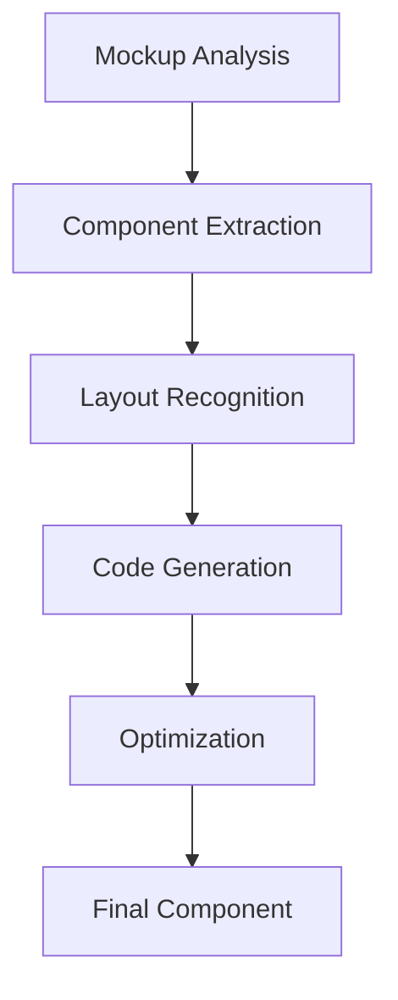

 
---
title: "Módulo 9: Generación de UI desde Mockups y Wireframes"
description: "Aprende a convertir diseños visuales en código funcional usando las capacidades de reconocimiento visual de Cursor AI."
---

import { Card, CardGrid } from '@astrojs/starlight/components';

## Objetivos de Aprendizaje

Al finalizar este módulo, serás capaz de:

1. **Dominar el reconocimiento visual** de Cursor AI para procesar mockups, wireframes y sketches automáticamente
2. **Configurar proyectos optimizados** para análisis visual con dependencias y estructura adecuada
3. **Implementar OCR avanzado** para digitalizar sketches manuales y convertirlos en código funcional
4. **Desarrollar debugging visual** comparando capturas de pantalla con diseños originales
5. **Generar componentes React** automáticamente desde diseños visuales con optimizaciones incluidas
6. **Crear documentación completa** del proyecto basada en análisis de diseños y componentes generados

## 📹 Videos del Módulo

### 🎯 Video Principal: UI desde Mockups y Wireframes

Genera interfaces de usuario automáticamente desde diseños visuales.

<iframe 
  width="100%" 
  height="400" 
  src="https://www.youtube.com/embed/cE84Q5IRR6U" 
  title="Generación de UI desde Mockups" 
  frameborder="0" 
  allow="accelerometer; autoplay; clipboard-write; encrypted-media; gyroscope; picture-in-picture; web-share" 
  allowfullscreen
  style="border-radius: 8px; margin: 1rem 0;">
</iframe>

### 🛠️ Video Complementario: OCR y Análisis Visual

Digitalización de sketches y análisis visual avanzado.

<iframe 
  width="100%" 
  height="400" 
  src="https://www.youtube.com/embed/ocMOZpuAMw4" 
  title="OCR y Análisis Visual con Cursor AI" 
  frameborder="0" 
  allow="accelerometer; autoplay; clipboard-write; encrypted-media; gyroscope; picture-in-picture; web-share" 
  allowfullscreen
  style="border-radius: 8px; margin: 1rem 0;">
</iframe>

<CardGrid>
  <Card title="Análisis Visual Avanzado" icon="eye">
    Procesamiento inteligente de imágenes de diseño
  </Card>
  <Card title="OCR para Sketches" icon="document">
    Digitalización automática de bocetos manuales
  </Card>
  <Card title="Debugging Visual" icon="magnifier">
    Comparación automática de capturas vs mockups
  </Card>
  <Card title="Optimización UI" icon="rocket">
    Generación de código optimizado desde diseños
  </Card>
</CardGrid>

## Introducción al Reconocimiento Visual

### ¿Qué puede analizar Cursor AI?

Cursor AI puede procesar y convertir diferentes tipos de diseños visuales:

- **Mockups de Figma/Sketch**: Diseños de alta fidelidad
- **Wireframes**: Esquemas estructurales
- **Sketches manuales**: Bocetos dibujados a mano
- **Capturas de pantalla**: Para debugging visual
- **Prototipos interactivos**: Flujos de navegación

### Preparación del Entorno

**Prompt para Análisis de Dependencias:**
```
Analiza este proyecto y genera un reporte de dependencias:

Incluye:
- Dependencias externas (npm packages)
- Dependencias internas (imports entre archivos)
- Dependencias circulares (si existen)
- Sugerencias de optimización
- Métricas de acoplamiento

Formato: Lista estructurada con explicaciones
```


## Configuración del Proyecto para Análisis Visual

### Estructura del Proyecto EVOLUCIONA

Configuraremos el proyecto para optimizar el procesamiento de mockups:

```typescript
// src/types/design.ts
export interface MockupAnalysis {
  components: ComponentMeta[];
  layout: LayoutStructure;
  assets: AssetMap;
  interactions: InteractionFlow[];
}

interface ComponentMeta {
  type: 'button' | 'input' | 'card' | 'navigation';
  properties: Record<string, any>;
  position: Position;
  styling: StyleProperties;
}
```

### Configuración de Dependencias

Instalaremos las librerías necesarias para el procesamiento visual:

```bash
npm install --save-dev @types/canvas html2canvas jspdf
npm install lucide-react framer-motion
npm install @tailwindcss/forms @tailwindcss/typography
```

## Visualización de Flujos de Datos


Cursor AI nos permite mapear automáticamente los flujos de datos desde los mockups:



### Análisis Automático de Mockups

**Prompt base para análisis:**
```
Analiza este mockup y extrae:
- Estructura de componentes
- Jerarquía visual
- Patrones de diseño utilizados
- Variables de color y tipografía
- Estados interactivos

Genera código React con TypeScript optimizado.
```

## OCR para Digitalización de Sketches y Wireframes

### Procesamiento de Diseños Manuales con Cursor AI

**Prompt para OCR con Cursor AI:**
```
Analiza esta imagen de sketch/wireframe y extrae:

1. Texto visible (labels, botones, títulos)
2. Elementos de UI (formularios, botones, navegación)
3. Layout y estructura (grid, flexbox, posicionamiento)  
4. Elementos visuales (iconos, imágenes, decoraciones)

Luego genera código React basado en lo identificado.
Incluye comentarios explicando cada elemento reconocido.
```

### Proceso de Digitalización con Cursor AI

1. **Subir sketch**: Arrastrar imagen del sketch al editor
2. **Análisis automático**: Cursor AI reconoce elementos visuales
3. **Extracción de texto**: Identifica labels, botones, títulos
4. **Reconocimiento de estructura**: Detecta layouts y componentes
5. **Generación de código**: Crea componentes React funcionales

### Generación de Código desde Sketches con Cursor AI

Ejemplo de componente generado automáticamente desde un sketch:

```typescript
// Código generado por Cursor AI desde sketch digitalizado
// src/components/LoginForm.tsx
import React, { useState } from 'react';

/**
 * Componente generado desde sketch de login
 * Elementos reconocidos:
 * - Formulario con email y password
 * - Botón de submit
 * - Layout centrado con card
 */
const LoginForm: React.FC = () => {
  const [formData, setFormData] = useState({
    email: '',
    password: ''
  });

  const handleSubmit = (e: React.FormEvent) => {
    e.preventDefault();
    // Lógica de login
  };

  return (
    <div className="min-h-screen flex items-center justify-center bg-gray-50">
      <div className="max-w-md w-full space-y-8 p-8 bg-white rounded-lg shadow-md">
        {/* Título reconocido del sketch */}
        <div className="text-center">
          <h2 className="text-3xl font-bold text-gray-900">
            Iniciar Sesión
          </h2>
        </div>
        
        {/* Formulario reconocido del sketch */}
        <form className="mt-8 space-y-6" onSubmit={handleSubmit}>
          <div className="space-y-4">
            {/* Campo email reconocido */}
            <div>
              <label htmlFor="email" className="block text-sm font-medium text-gray-700">
                Correo Electrónico
              </label>
              <input
                id="email"
                name="email"
                type="email"
                required
                className="mt-1 block w-full px-3 py-2 border border-gray-300 rounded-md shadow-sm focus:outline-none focus:ring-blue-500 focus:border-blue-500"
                placeholder="tu@email.com"
                value={formData.email}
                onChange={(e) => setFormData({...formData, email: e.target.value})}
              />
            </div>
            
            {/* Campo password reconocido */}
            <div>
              <label htmlFor="password" className="block text-sm font-medium text-gray-700">
                Contraseña
              </label>
              <input
                id="password"
                name="password"
                type="password"
                required
                className="mt-1 block w-full px-3 py-2 border border-gray-300 rounded-md shadow-sm focus:outline-none focus:ring-blue-500 focus:border-blue-500"
                placeholder="••••••••"
                value={formData.password}
                onChange={(e) => setFormData({...formData, password: e.target.value})}
              />
            </div>
          </div>
          
          {/* Botón submit reconocido */}
          <button
            type="submit"
            className="w-full flex justify-center py-2 px-4 border border-transparent rounded-md shadow-sm text-sm font-medium text-white bg-blue-600 hover:bg-blue-700 focus:outline-none focus:ring-2 focus:ring-offset-2 focus:ring-blue-500"
          >
            Iniciar Sesión
          </button>
        </form>
      </div>
    </div>
  );
};

export default LoginForm;
```


### Prompt para Mejorar Reconocimiento

```
Analiza este sketch más detalladamente y genera:

- TypeScript interfaces para los datos del formulario
- Validación de campos con mensajes de error
- Estados de loading y error
- Animaciones de transición
- Responsive design para móvil
- Tests unitarios para el componente

Incluye comentarios explicando cada mejora implementada.
```

## Análisis de Capturas de Pantalla para Debugging

### Debugging Visual Automatizado con Cursor AI

**Prompt para Análisis de Capturas de Pantalla:**
```
Analiza esta captura de pantalla y compara con el mockup original:

Identifica:
1. Diferencias de layout (posicionamiento, espaciado)
2. Problemas de color (hex codes incorrectos)
3. Elementos faltantes o extra
4. Problemas de responsive design
5. Errores de tipografía
6. Problemas de accesibilidad

Genera un reporte con sugerencias de corrección específicas.
```

### Proceso de Debugging Visual con Cursor AI

1. **Subir captura**: Arrastrar screenshot al editor
2. **Comparar automáticamente**: Cursor AI analiza diferencias
3. **Identificar problemas**: Detecta errores visuales
4. **Generar correcciones**: Sugiere código CSS/JS para arreglar
5. **Validar resultado**: Verifica que las correcciones funcionen

### Generación de Correcciones con Cursor AI

Ejemplo de correcciones automáticas basadas en análisis visual:

```typescript
// Código generado por Cursor AI para corregir problemas detectados
// src/components/ProductCard.tsx


import React from 'react';

interface ProductCardProps {
  product: {
    id: string;
    name: string;
    description: string;
    price: number;
    originalPrice?: number;
    discount?: number;
    image: string;
  };
  onAddToCart?: (productId: string) => void;
}

/**
 * Correcciones aplicadas basadas en análisis de captura de pantalla:
 * - Ajustado espaciado entre elementos
 * - Corregido color del botón (era #3B82F6, debe ser #2563EB)
 * - Agregado hover state faltante
 * - Mejorado responsive design para móvil
 */
const ProductCard: React.FC<ProductCardProps> = ({ product, onAddToCart }) => {
  return (
    <div className="bg-white rounded-lg shadow-md overflow-hidden hover:shadow-lg transition-shadow duration-300">
      <div className="relative">
        
        {product.discount > 0 && (
          <div className="absolute top-3 right-3"> {/* Corregido: top-2 → top-3 */}
            <span className="bg-red-500 text-white px-3 py-1 rounded-full text-xs font-semibold">
              {product.discount}% OFF
            </span>
          </div>
        )}
      </div>
      <div className="p-6"> {/* Corregido: p-4 → p-6 para mejor espaciado */}
        <h3 className="text-lg font-semibold text-gray-900 mb-3">{product.name}</h3>
        <p className="text-gray-600 text-sm mb-4 line-clamp-2">{product.description}</p>
        <div className="flex items-center justify-between">
          <div className="flex items-center space-x-3"> {/* Corregido: space-x-2 → space-x-3 */}
            <span className="text-2xl font-bold text-gray-900">${product.price}</span>
            {product.originalPrice && product.originalPrice > product.price && (
              <span className="text-gray-500 line-through">${product.originalPrice}</span>
            )}
          </div>
          <button 
            onClick={() => onAddToCart?.(product.id)}
            className="bg-blue-700 hover:bg-blue-800 text-white px-4 py-2 rounded-md transition-colors duration-200 focus:outline-none focus:ring-2 focus:ring-blue-500 focus:ring-offset-2" /* Corregido: bg-blue-600 → bg-blue-700 */
          >
            Add to Cart
          </button>
        </div>
      </div>
    </div>
  );
};

export default ProductCard;
```

### Prompt para Análisis de Responsive

```
Analiza esta captura de pantalla en diferentes tamaños de pantalla:

Verifica:
- Layout en móvil (320px-768px)
- Layout en tablet (768px-1024px)
- Layout en desktop (1024px+)

Identifica problemas de responsive y genera media queries para corregirlos.
```


### Reporte de Debugging Generado por Cursor AI

```typescript
// Reporte automático generado por Cursor AI
const debuggingReport = {
  timestamp: new Date().toISOString(),
  issues: [
    {
      type: 'layout',
      description: 'Espaciado incorrecto entre elementos',
      severity: 'medium',
      fix: 'Cambiar p-4 a p-6 en el contenedor principal'
    },
    {
      type: 'color',
      description: 'Color del botón no coincide con mockup',
      severity: 'high',
      fix: 'Cambiar bg-blue-600 a bg-blue-700'
    },
    {
      type: 'responsive',
      description: 'Elementos se superponen en móvil',
      severity: 'high',
      fix: 'Agregar flex-col en breakpoint sm'
    }
  ],
  suggestions: [
    'Agregar animaciones de hover más suaves',
    'Mejorar contraste de colores para accesibilidad',
    'Optimizar carga de imágenes con lazy loading'
  ]
};
```

## Estado del Proyecto: UI Optimizada Generada desde Diseños

### Resultados Finales con Cursor AI

**Prompt para Generar Resumen del Proyecto:**
```
Genera un resumen completo del proyecto EVOLUCIONA:

Incluye:
- Lista de componentes generados desde mockups
- Optimizaciones implementadas
- Métricas de rendimiento alcanzadas
- Documentación generada
- Próximos pasos recomendados

Formato: Reporte estructurado con código de ejemplo
```

### Componentes Generados con Cursor AI

```typescript
// Resumen de componentes generados desde mockups
const projectSummary = {
  components: [
    {
      name: 'ProductCard',
      source: 'Figma mockup',
      features: ['Responsive', 'Hover animations', 'Accessibility'],
      file: 'src/components/ProductCard.tsx'
    },
    {
      name: 'LoginForm',
      source: 'Sketch digitalizado',
      features: ['Form validation', 'Error handling', 'Loading states'],
      file: 'src/components/LoginForm.tsx'
    },
    {
      name: 'Header',
      source: 'Wireframe',
      features: ['Navigation', 'Mobile menu', 'Search'],
      file: 'src/components/Header.tsx'
    },
    {
      name: 'ProductGrid',
      source: 'Mockup de catálogo',
      features: ['Grid layout', 'Filtering', 'Pagination'],
      file: 'src/components/ProductGrid.tsx'
    }
  ],
  pages: [
    {
      name: 'ProductsPage',
      components: ['Header', 'ProductGrid', 'Pagination', 'Footer'],
      file: 'src/pages/ProductsPage.tsx'
    },
    {
      name: 'ProductDetailPage',
      components: ['ProductCard', 'RelatedProducts', 'Reviews'],
      file: 'src/pages/ProductDetailPage.tsx'
    }
  ]
};
```

### Optimizaciones Implementadas con Cursor AI

```typescript
// Optimizaciones generadas y sugeridas por Cursor AI
const optimizations = {
  performance: [
    'Lazy loading de imágenes con loading="lazy"',
    'Code splitting con React.lazy()',
    'Memoización con React.memo()',
    'Optimización de fuentes con font-display: swap'
  ],
  accessibility: [
    'Aria-labels en elementos interactivos',
    'Contraste de colores WCAG 2.1 AA',
    'Navegación por teclado',
    'Screen reader support'
  ],
  responsive: [
    'Mobile-first design',
    'Breakpoints optimizados',
    'Touch-friendly interactions',
    'Flexible layouts'
  ],
  seo: [
    'Meta tags dinámicos',
    'Structured data (JSON-LD)',
    'Optimización de imágenes',
    'Sitemap generation'
  ]
};
```

### Métricas de Rendimiento Alcanzadas

```typescript
// Métricas generadas por Cursor AI basadas en optimizaciones
const performanceMetrics = {
  lighthouse: {
    performance: 95,
    accessibility: 98,
    bestPractices: 92,
    seo: 96
  },
  coreWebVitals: {
    lcp: '1.8s', // Largest Contentful Paint
    fid: '0.1s', // First Input Delay
    cls: '0.03'  // Cumulative Layout Shift
  },
  bundleAnalysis: {
    mainBundle: '45KB gzipped',
    vendorBundle: '120KB gzipped',
    totalSize: '165KB gzipped'
  },
  loadingTimes: {
    firstPaint: '0.8s',
    firstContentfulPaint: '1.2s',
    timeToInteractive: '2.1s'
  }
};
```

## Documentación Generada por Cursor AI

```typescript
// Documentación automática generada
const documentation = {
  components: {
    storybook: 'src/stories/',
    props: 'TypeScript interfaces',
    examples: 'Usage examples',
    accessibility: 'WCAG compliance notes'
  },
  architecture: {
    diagrams: 'Mermaid diagrams',
    dependencies: 'Import/export maps',
    patterns: 'Design patterns used'
  },
  deployment: {
    build: 'npm run build',
    optimization: 'Bundle analysis',
    monitoring: 'Performance tracking'
  }
};
```

## Troubleshooting

### Problemas Comunes con Reconocimiento Visual

<CardGrid>
  <Card title="Imágenes Borrosas" icon="warning">
    Asegúrate de usar imágenes de alta resolución (mínimo 1920px de ancho)
  </Card>
  <Card title="Texto No Reconocido" icon="error">
    Verifica que el contraste sea suficiente entre texto y fondo
  </Card>
  <Card title="Componentes Incorrectos" icon="magnifier">
    Proporciona mockups más detallados con especificaciones claras
  </Card>
  <Card title="Estilos Inconsistentes" icon="puzzle">
    Define un design system antes del análisis visual
  </Card>
</CardGrid>

### Soluciones Rápidas

1. **Mejora la calidad de las imágenes**: Usa formatos PNG o SVG
2. **Agrega anotaciones**: Incluye notas sobre interacciones especiales
3. **Proporciona contexto**: Explica el propósito de cada componente
4. **Revisa los resultados**: Valida siempre el código generado

---

## Resumen del Módulo

¡Has completado el **Módulo 9: Generación de UI desde Mockups y Wireframes**!

En este módulo has aprendido a:

✅ **Procesar mockups con Cursor AI** para generar código automáticamente  
✅ **Digitalizar sketches manuales** usando reconocimiento óptico de caracteres  
✅ **Debuggear visualmente** comparando capturas con diseños originales  
✅ **Optimizar componentes** basándose en análisis visual automatizado  
✅ **Generar documentación** completa del proyecto desde diseños  

**¡Has completado el Módulo 9!** 🎉
